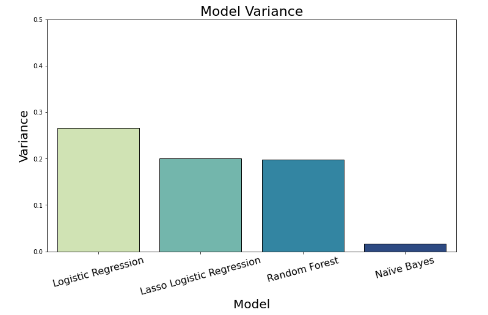

# Classifying Passive vs. Active Revenge in Related Subreddits using NLP

## Problem Statement
Are the differences between Active vs. Passive revenge classifiable in the subreddits r/MaliciousCompliance vs.  r/pettyrevenge and r/ProRevenge. r/MaliciousCompliance is Passive not premeditated revenge and the other 2 subreddits are more Active planned acts of vengeance. 

Moderators for r/MaliciousCompliance can use this classification model to help filter submissions that might be better suited for another subreddit.

## Executive Summary
We will use and evaluate a variety of classifcation models including Logistic Regression, regularized Lasso Logistic Regression, Random Forest, and Multinomial Naïve Bayes and attempt to model the distinction between active and passive revenge in subreddits. 

In order to collect our reddit data, we will use the PushShift API and pull 550 days of data.  We then will spend some time cleaning, preprocessing and getting the data ready for modeling. All of our text will need to be lemmatize to shorten the words to their base form for standardization and additionally word vectorized to use the text as features in our models. We will evaluate all model results, comparing them to our baseline classifier and to eachother. These models will be mainly evaluated on the metric of accuracy as we want to know if the moderators of r/MaliciousCompliance can use our work to filter submissions that might belong in another subreddit.

## Project Workflow

### 1. Web Scraping
In this first notebook, we used [Pushshift's](https://github.com/pushshift/api) API to gather 550 days of Subreddit submission data from Reddit.
  
### 2 & 3. Project Overview & Data Cleaning
In this notebook, we addressed our problem statement and laid out the overview and background information for our project. We also tackled the wrangling of our data that we pulled and cleaned it up to be able to use the subreddit submission text as the features for our models. This included dropping unecessary columns, dropping posts where text had been removed or deleted, dropping null values, removing html and markdown artifacts, removing punctuation, lowercasing all text, and combining text from titles and selftext into one all_text column.

### 4. Lemmatizing, Vectorizing, and EDA
Natural Language Processing! This notebook converts standard text data (like Titles and Submissions) into a format that allows us to analyze it and use it in our modeling. Additionally, we did some exploratory data analysis to determine what our most important features will be (ie. most frequent words in each subreddit that distinguish them from other subreddits similar in topic). 
  
### 5. Modeling & Results
In this notebook, there are 4 classification models that were built:
   - Baseline Classifier
   - Logistic Regression
   - Lasso Logistic Regression
   - Random Forest
   - Multinomial Naïve Bayes

**Methodology for training each model:**
   - Choose hyperparameters we want to tune.
   - Decide what model performance metrics to use - I use Accuracy as the main metric.
   - Use TfidVectorizer to prepare our text for modeling with Pipelines & Randomized Search Cross Validation in order to find the best hyperparameters that balance bias and variance.
   - Compare model performance of each model and determine which is best for as our production model.
 

   
### Conclusions & Recommendations
Our models exceeded the baseline of ~53% with the Multinomial Naïve Bayes production model having an accuracy of ~76% on the test data. This model can serve as a great tool for the r/MaliciousCompliance moderators to use as a general filter to highlight submissions that may be a better fit for other subreddits like r/pettyrevenge or r/ProRevenge. I would not necessarily use this model to fully auto-moderate and auto-remove submissions due to the occurences of several misclassifications of predicting Active Revenge Subreddit when it was really the Passive Revenge Subreddit r/MaliciousCompliance. 

Future improvements to this model would be spending more time tuning hyperparamters and trying a few other classification models as well as removing more recent submissions that might not have been moderated just yet.

---
## References:
1. Data was scraped from Pushshift Reddit API https://github.com/pushshift/api 
2. https://www.psychologytoday.com/us/blog/tech-support/201707/the-psychology-revenge-and-vengeful-people 
3. David S. Chester, C. Nathan DeWall, The pleasure of revenge: retaliatory aggression arises from a neural imbalance toward reward, Social Cognitive and Affective Neuroscience, Volume 11, Issue 7, July 2016, Pages 1173–1182, https://doi.org/10.1093/scan/nsv082 
4. https://en.wikipedia.org/wiki/Malicious_compliance
5. https://github.com/gwenrathgeber/subreddit_text_classification
